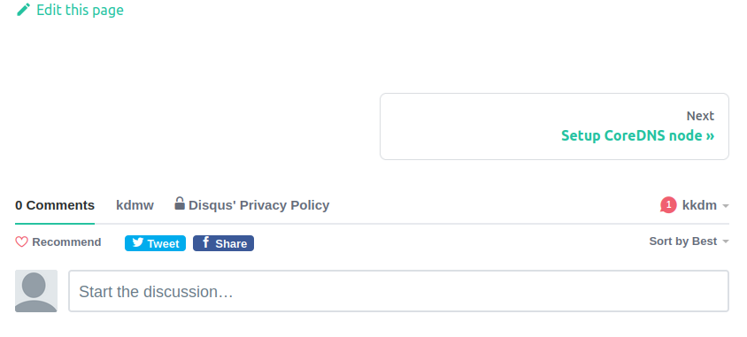

## References

- [How to add Forum like disqus in docusaurus](https://www.coderhackers.com/blog/2020/02/29/how-to-add-forum-to-docusaurus/)
- [disqus-react](https://github.com/disqus/disqus-react)
- [docusaurus-theme-classic](https://github.com/facebook/docusaurus/tree/master/packages/docusaurus-theme-classic)

## Install `disqus-react`

```bash
$ yarn add disqus-react
```

```
$ git diff
diff --git a/package.json b/package.json
index 25b6e10..857415a 100644
--- a/package.json
+++ b/package.json
@@ -15,6 +15,7 @@
     "@docusaurus/preset-classic": "2.0.0-alpha.70",
     "@mdx-js/react": "^1.5.8",
     "clsx": "^1.1.1",
+    "disqus-react": "^1.0.10",
     "react": "^16.8.4",
     "react-dom": "^16.8.4"
   },
```

## Edit `DocItem` theme

### Download `DocItem` to local

We cannot just `swizzle` DocItem theme since it might be highly changed in the future. We need to add `--danger` flag.

```bash
$ yarn run swizzle @docusaurus/theme-classic DocItem
yarn run v1.22.5
$ docusaurus swizzle @docusaurus/theme-classic DocItem
DocItem is an internal component, and have a higher breaking change probability. If you want to swizzle it, use the "--danger" flag.
error Command failed with exit code 1.
info Visit https://yarnpkg.com/en/docs/cli/run for documentation about this command.
```

Like this.

```
$ yarn run swizzle @docusaurus/theme-classic DocItem --danger
```

### Edit `DocItem` theme

```bash
$ vim src/theme/DocItem/index.js
```

```javascript
import { DiscussionEmbed } from 'disqus-react';

function DocItem(props) {
...
...

  const fmtId = permalink.replace(/^\//, '').replaceAll(/[\s\/]/gi, '-');
  const disqusId = fmtId == '' ? 'main' : fmtId;
...
...
  return <>
...
...
            <div className="margin-vert--lg">
              <DocPaginator metadata={metadata} />
            </div>
            <DiscussionEmbed
              shortname='kdmw'
              config={{
                url: siteUrl + permalink,
                identifier: disqusId,
                title: title,
              }}
            />
...
...
```

#### Image



