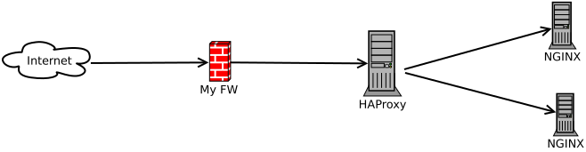

## Goal

- Log haproxy status and traffic to file separately
- Set custom log format for traffic
- Show only traffic related logs in log file

## TL;DR

### Send log to rsyslog

#### `haproxy.cfg`

```
global
	log /dev/log	local0
	chroot /var/lib/haproxy
	...

defaults
	log	global
	mode	http
	option	httplog
	...
	log-format "%ci:%cp [%tr] %{+Q}r %ST %B %tsc %ft %b/%s %TR/%Tw/%Tc/%Tr/%Ta %rc"
```

### Receive and Distribute logs to files

#### `/etc/rsyslog.d/49-haproxy.conf`

```
$AddUnixListenSocket /var/lib/haproxy/dev/log
# remove unnecessary messages
$template rawMsg,"%msg:2:$%\n"
:programname, startswith, "haproxy" {
  # error and non-traffic messages goes to error.log
  local0.emerg,local0.alert,local0.err,local0.warning /var/log/haproxy/error.log; rawMsg
  local0.emerg,local0.alert,local0.err,local0.warning stop

  # other messages such as starting up... goes to admin.log
  local0.notice /var/log/haproxy/admin.log; rawMsg
  local0.notice stop

  # traffic related (like access log) goes to traffic.log
  local0.info /var/log/haproxy/traffic.log; rawMsg
  local0.info stop

  stop
}
```

## Background

It seems HAProxy does not have file logging but does support syslog output. [Introduction to HAProxy Logging](https://www.haproxy.com/blog/introduction-to-haproxy-logging/)
This is troublesome for me since I am not familiar with rsyslog honestly(Well.. Let's put it aside for now...).

I'll write down as memo of how I achieve HAProxy logging to file.

## What I want to do

I want to separate various of logs for HAProxy logs.

### Image

Let's say we have HAProxy running as reverse proxy(with L7 balancing). So HAProxy will terminate SSL, forward request by `Host` request header and so on, to our backend server(In this below ssample, it's NGINX servers which serve static contents).



### Issues

- HAProxy does not support file logging
- By default, HAProxy outputs unnecessary logs such as some starting up, reloading, warning ans so on(warnings or errors should be abusolutely logged, although)
  - This makes analysis difficult for me
- HAProxy default log format is not easy to read(Is this only me...?)

## Solution

1. Log to syslog
2. Create custom log format
3. Filter logs via syslog

### Log to syslog

#### `/etc/haproxy/haproxy.cfg`

##### Log output setting

First, let's set log output setting as global setting. This will output logs to `/dev/log` as `local0` facility.

```
global
	log /dev/log	local0
```

##### Use the log setting as default

Then set log setting for default block. This will use global log setting as default.

```
defaults
	log	global
```

The setting for syslog is done.

### Set custom log for frontend

Let's configure log format for specific frontend. If you are ok to configure the log format as default, it is ok to set in `default` block.
Since I am familiar with NGINX/Apache access log format, let me set similar with those.

```
frontend web
	mode http
	bind :80
	log-format "%ci:%cp [%tr] %{+Q}r %ST %B %tsc %ft %b/%s %TR/%Tw/%Tc/%Tr/%Ta %rc"
```

- `%ci:%cp`: CLIENT-IP:CLIENT-PORT (e.g. `1.1.1.1:34567`
- `%tr`: Local Timestamp (e.g. `16/Jan/2021:23:14:18.044`)
- `%{+Q}r`: Double Quoted HTTP Reqest (e.g. `"GET /index.html HTTP/1.1"`)
- `%ST`: Status Code (e.g. `200`)
- `%B`: Bytes Sent to Client (e.g. `282`)
- `%tsc`: Session State when Terminate.
- `%ft`: Frontend Name
- `%b`: Backend Name
- `%s`: Server Name
- `%TR/%Tw/%Tc/%Tr/%Ta`: Time duration for each phase [Timing Events](https://www.haproxy.com/documentation/hapee/latest/onepage/#8.4)
- `%rc`: Retries

### Filter logs via syslog

#### `/etc/rsyslog.d/49-haproxy.conf`

Finally we can filter haproxy log via rsyslog.

1. Catch all non-info logs as `error.log` and `admin.log`
2. Filter only `info` priority as `traffic.log`

```
$AddUnixListenSocket /var/lib/haproxy/dev/log
$template rawMsg,"%msg:2:$%\n"
# Send HAProxy messages to a dedicated logfile
:programname, startswith, "haproxy" {
  # error 
  local0.emerg,local0.alert,local0.err,local0.warning /var/log/haproxy/error.log; rawMsg
  local0.emerg,local0.alert,local0.err,local0.warning stop

  # admin
  local0.notice /var/log/haproxy/admin.log; rawMsg
  local0.notice stop

  # traffic
  local0.info /var/log/haproxy/traffic.log; rawMsg
  local0.info stop

  stop
}
```

#### Restart rsyslog

```
sudo systemctl restart rsyslog
```

## Example

It seems someone is trying to find vulnarable path, although.

```
45.155.205.108:53104 [17/Jan/2021:12:53:23.365] "GET /wp-content/plugins/wp-file-manager/readme.txt HTTP/1.1" 503 221 SC-- web~ web/<NOSRV> -1/-1/-1/-1/0 0
```
