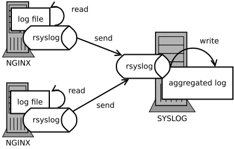

## Goal

- Aggregate logs to rsyslog server
  - Aggregate targets are nginx access log
- Don't send logs directly
  - Use rsyslog as a log forwarder
- NGINX log example is used for my explanation.

## Background

NGINX is writing log to its local disk. Since I don't want to apply change to NGINX itself(And I want to use NGINX as usual usecase, writing logs to local disk).
Filebeat is recent trend, it seems. But That does not mean old-fashion style is worse than new ones.
Since `rsyslog` is installed as OS standard recently, I chose rsyslog as log forwarder. (I'm using ELK stack in my workplace, although)

## Image




## Setup HAProxy with prometheus exporter

- Install HAProxy via package manager
- Install HAProxy from source
- Configure HAProxy
- Prepare HAProxy systemd unit

## Official docs

- [ansible](https://docs.ansible.com/)
- [Ubuntu](https://releases.ubuntu.com/20.04/)
- [HAProxy](http://www.haproxy.org/)
- [HAProxy with exporter](https://www.haproxy.com/blog/haproxy-exposes-a-prometheus-metrics-endpoint/)

## Prerequisite

### Setup workstation

- Ubuntu 20.04

```bash
$ cat /etc/lsb-release 
DISTRIB_ID=Ubuntu
DISTRIB_RELEASE=20.04
DISTRIB_CODENAME=focal
DISTRIB_DESCRIPTION="Ubuntu 20.04 LTS"
```
- ansible

```bash
$ sudo apt-get install ansible
$ ansible --version | grep 'ansible [0-9]'
ansible 2.9.6
```

## Prepare Ansible Playbook

### Role

#### `haproxy.yml`

```yaml
---
- hosts: haproxy
  remote_user: youruser
  become: true
  roles:
  - disable_resolved
  - haproxy
```

### Disable systemd-resolved (If it's running)

Since I am using my own DNS server, I need to disable `systemd-resolved` service. If `resolv.conf` is already set properly, we can skip this part.

[Reference](../dns/setup-coredns.md)

To check that, we may run below. If it's running, we'll stop and disable it.

```bash
systemctl status systemd-resolved
```

#### `roles/disable_resolved/tasks/main.yml`

```yaml
---
- name: Check /etc/resolv.conf link target
  stat:
    path: /etc/resolv.conf
  register: resolv_conf

- name: Remove /etc/resolv.conf symbolic link
  file:
    path: /etc/resolv.conf
    state: absent
  when: resolv_conf.stat.lnk_source == "/run/systemd/resolve/stub-resolv.conf"

- name: create symlink
  file:
    src: /run/systemd/resolve/resolv.conf
    dest: /etc/resolv.conf
    state: link
```

### Install HAProxy

#### `roles/haproxy/tasks/main.yml`

```yaml
---
- import_tasks: package.yml
- import_tasks: install.yml
- import_tasks: configure.yml
```

#### `roles/haproxy/tasks/package.yml`

To use official's systemd unit file, we'll use it from package installed one.

```yaml
---
- name: install packages
  apt:
    pkg:
    - haproxy
```

#### `roles/haproxy/tasks/install.yml` 

Install HAProxy from source

```yaml
---
- name: install packages
  apt:
    pkg:
    - git
    - ca-certificates
    - gcc
    - libc6-dev
    - liblua5.3-dev
    - libpcre3-dev
    - libssl-dev
    - libsystemd-dev
    - make
    - wget
    - zlib1g-dev

- name: create temp dir
  tempfile:
    state: directory
    suffix: haproxy
  register: tmp_dir

- name: git clone ha-proxy
  git:
    repo: 'https://github.com/haproxy/haproxy.git'
    dest: "{{ tmp_dir.path }}/haproxy"
  when: tmp_dir.changed and tmp_dir is defined

- name: dir exist
  stat:
    path: "{{ tmp_dir.path }}/haproxy"
  register: haproxy_dir
  when: tmp_dir.changed

- name: make
  make:
    chdir: "{{ tmp_dir.path }}/haproxy"
    params:
      TARGET: linux-glibc
      USE_LUA: 1
      USE_OPENSSL: 1
      USE_PCRE: 1
      USE_ZLIB: 1
      USE_SYSTEMD: 1
      EXTRA_OBJS: "contrib/prometheus-exporter/service-prometheus.o"
  when: haproxy_dir.changed and haproxy_dir.stat.exists
  register: make_haproxy

- name: Install haproxy
  make:
    chdir: "{{ tmp_dir.path }}/haproxy"
    target: install-bin
  when: make_haproxy.changed

- name: delete tempdir
  file:
    state: absent
    path: "{{ tmp_dir.path }}"
  when: tmp_dir.changed
```

### Configure HAProxy

#### `roles/haproxy/tasks/configure.yml`

If you need any ssl certs, directory for storing certs is required.

```yaml
- name: Create dir for certs
  file:
    path: /var/lib/haproxy/certs
    owner: haproxy
    group: haproxy
    mode: 0700
    state: directory
- name: Put config file
  copy:
    src: etc/haproxy/haproxy.cfg
    dest: /etc/haproxy/haproxy.cfg
    owner: root
    group: root
    mode: 0644
- name: reload haproxy service
  systemd:
    name: haproxy
    state: reloaded
    enabled: true
```

## Run ansible-playbook

```bash
ansible-playbook -v -K haproxy.yml
```

## Prepare HAProxy systemd unit file

If haproxy is installed via pakcage manager, we don't need to put systemd unit file newly.

```bash
$ systemctl status haproxy
```

## Configure HAProxy to export metrics

### Setup `frontend`

```
frontend stats
	bind :8404
	option http-use-htx
	http-request use-service prometheus-exporter if { path /metrics }
	stats enable
	stats uri /stats
	stats refresh 10s
```

Then reload haproxy.

```bash
$ sudo systemctl reload haproxy
```

### Confirmation via `curl`

```bash
$ curl -s localhost:8404/metrics | head
# HELP haproxy_process_nbthread Configured number of threads.
# TYPE haproxy_process_nbthread gauge
haproxy_process_nbthread 4
# HELP haproxy_process_nbproc Configured number of processes.
# TYPE haproxy_process_nbproc gauge
haproxy_process_nbproc 1
# HELP haproxy_process_relative_process_id Relative process id, starting at 1.
# TYPE haproxy_process_relative_process_id gauge
haproxy_process_relative_process_id 1
# HELP haproxy_process_start_time_seconds Start time in seconds.
```

