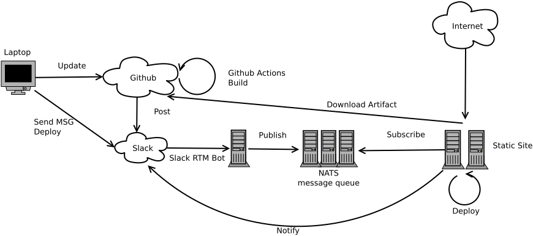

## Overall Diagram

## What are used ?

- NATS Streaming Server [NATS](https://nats.io/)
- Github Actions [Github Actions](https://docs.github.com/en/free-pro-team@latest/actions)
- Slack RTM Client [slack-bot-rs](https://github.com/kkdm/slack-bot-rs)
- NATS stan client [Github](https://github.com/nats-io/stan.go)
  - publisher [nats-pub](https://github.com/kkdm/nats-pub)
  - subscriber [site-deploy](https://github.com/kkdm/site-deploy)
- NGINX(To serve static sites)

## What is it for ?

- Deploying my static site
- Deployment can be done without typing any linux command but via slack

## TODOs

- Add one more server as test environment
- Support multiple domain deployment
- Support other command
  - It currently only supports `deploy` operation

## Usage

